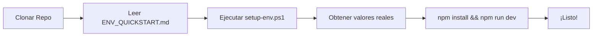
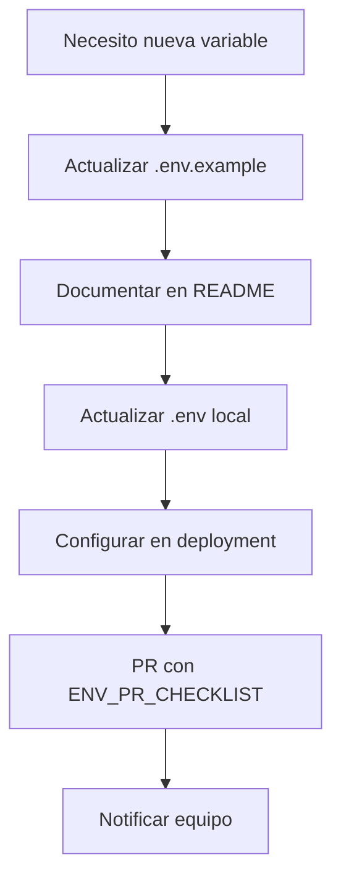
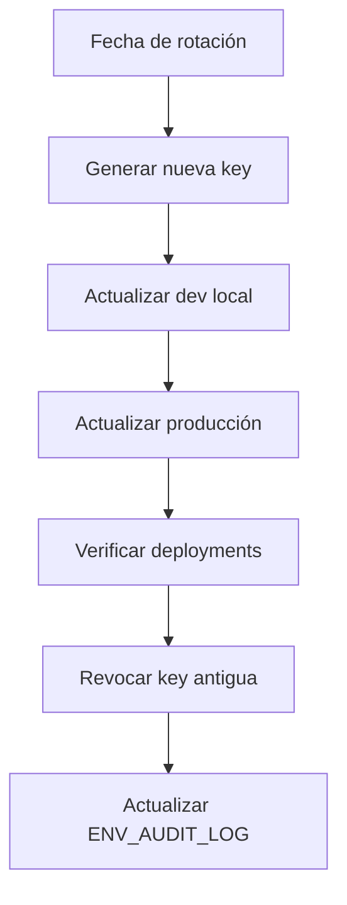

# 📚 Documentación del Proyecto - Índice

## 🔐 Variables de Entorno

### Para empezar (Nuevos Developers)
1. **[ENV_QUICKSTART.md](ENV_QUICKSTART.md)** ⚡ *5 min*
   - Setup rápido
   - Checklist de seguridad
   - FAQ esencial

### Guías Completas
2. **[ENV_BEST_PRACTICES.md](ENV_BEST_PRACTICES.md)** 📖 *15 min*
   - Mejores prácticas completas
   - Flujos de trabajo detallados
   - Procedimientos de emergencia
   - Troubleshooting

3. **[ENV_IMPLEMENTATION_SUMMARY.md](ENV_IMPLEMENTATION_SUMMARY.md)** 📦 *10 min*
   - Resumen de implementación
   - Arquitectura del sistema
   - Comparación de enfoques

### Procesos & Workflows
4. **[ENV_PR_CHECKLIST.md](ENV_PR_CHECKLIST.md)** ✅ *3 min*
   - Checklist pre-PR
   - Template de descripción
   - Errores comunes

5. **[ENV_AUDIT_LOG.md](ENV_AUDIT_LOG.md)** 📋 *Referencia continua*
   - Historial de cambios
   - Calendario de rotación
   - Registro de incidentes

## 📧 Integración con Google

6. **[GOOGLE_APPS_SCRIPT_SETUP.md](GOOGLE_APPS_SCRIPT_SETUP.md)**
   - Configuración del formulario de contacto
   - Setup de Google Apps Script
   - Integración con el sitio

## 🚀 Guías de Inicio Rápido por Rol

### Soy un Developer Nuevo
```
1. Lee: ENV_QUICKSTART.md
2. Ejecuta: .\setup-env.ps1
3. Verifica: npm run dev
```

### Soy un Tech Lead
```
1. Lee: ENV_BEST_PRACTICES.md
2. Lee: ENV_IMPLEMENTATION_SUMMARY.md
3. Revisa: ENV_AUDIT_LOG.md
```

### Voy a hacer un PR
```
1. Lee: ENV_PR_CHECKLIST.md
2. Verifica cada item del checklist
3. Documenta cambios de variables
```

### Necesito Rotar una Key
```
1. Lee: ENV_BEST_PRACTICES.md (sección "Procedimiento de Rotación")
2. Actualiza: ENV_AUDIT_LOG.md
3. Notifica al equipo
```

### Hubo una Filtración
```
1. Lee: ENV_BEST_PRACTICES.md (sección "Si una key se filtra")
2. Ejecuta procedimiento de emergencia
3. Documenta en: ENV_AUDIT_LOG.md (sección "Incidentes")
```

## 📂 Estructura de Archivos

```
landing/
├── docs/
│   ├── ENV_QUICKSTART.md              # ⚡ Inicio rápido
│   ├── ENV_BEST_PRACTICES.md          # 📖 Guía completa
│   ├── ENV_IMPLEMENTATION_SUMMARY.md  # 📦 Resumen implementación
│   ├── ENV_PR_CHECKLIST.md            # ✅ Checklist PRs
│   ├── ENV_AUDIT_LOG.md               # 📋 Log de auditoría
│   ├── GOOGLE_APPS_SCRIPT_SETUP.md    # 📧 Setup formulario
│   └── INDEX.md                        # 📚 Este archivo
├── .env.example                        # 📄 Template (versionado)
├── .env.development                    # 🔧 Dev config (versionado)
├── .env.production                     # 🚀 Prod template (versionado)
├── setup-env.ps1                       # 💻 Script Windows
└── setup-env.sh                        # 🐧 Script Mac/Linux
```

## 🎯 Flujos de Trabajo Comunes

### Onboarding de Nuevo Developer



**Archivos**: `ENV_QUICKSTART.md`, `setup-env.ps1`

### Agregar Nueva Variable



**Archivos**: `.env.example`, `README.md`, `ENV_PR_CHECKLIST.md`

### Rotar Key por Seguridad



**Archivos**: `ENV_BEST_PRACTICES.md`, `ENV_AUDIT_LOG.md`

## 🔗 Enlaces Rápidos

### Documentación Externa
- [Vite - Env Variables](https://vitejs.dev/guide/env-and-mode.html)
- [The Twelve-Factor App](https://12factor.net/config)
- [OWASP - Secrets Management](https://owasp.org/www-community/vulnerabilities/Use_of_hard-coded_password)

### Plataformas de Deployment
- [Vercel - Environment Variables](https://vercel.com/docs/concepts/projects/environment-variables)
- [Netlify - Environment Variables](https://docs.netlify.com/environment-variables/overview/)

### Herramientas Útiles
- [dotenv-vault](https://www.dotenv.org/docs/security/vault) - Para compartir secrets en equipo
- [1Password](https://1password.com/) - Gestor de contraseñas
- [git-secrets](https://github.com/awslabs/git-secrets) - Prevenir commits de secrets

## 📊 Métricas de la Documentación

| Documento | Tamaño | Tiempo de Lectura | Audiencia |
|-----------|--------|-------------------|-----------|
| ENV_QUICKSTART.md | 3.3 KB | 5 min | Developers |
| ENV_BEST_PRACTICES.md | 6.6 KB | 15 min | Todos |
| ENV_IMPLEMENTATION_SUMMARY.md | 7.2 KB | 10 min | Tech Leads |
| ENV_PR_CHECKLIST.md | 4.2 KB | 3 min | PR Reviewers |
| ENV_AUDIT_LOG.md | 2.4 KB | - | Referencia |
| GOOGLE_APPS_SCRIPT_SETUP.md | - | 10 min | Backend Setup |

## 🎓 Niveles de Conocimiento

### Nivel 1: Básico (Día 1)
- [ ] ENV_QUICKSTART.md
- [ ] Ejecutar setup-env.ps1
- [ ] Entender .env vs .env.example

### Nivel 2: Intermedio (Semana 1)
- [ ] ENV_BEST_PRACTICES.md
- [ ] ENV_PR_CHECKLIST.md
- [ ] Hacer primer PR con variables

### Nivel 3: Avanzado (Mes 1)
- [ ] ENV_IMPLEMENTATION_SUMMARY.md
- [ ] ENV_AUDIT_LOG.md
- [ ] Configurar deployment
- [ ] Rotar una key

### Nivel 4: Expert (Tech Lead)
- [ ] Toda la documentación
- [ ] Configurar CI/CD
- [ ] Manejar incidentes de seguridad
- [ ] Auditorías y compliance

## 🆘 Soporte

### ¿Dónde buscar ayuda?

1. **Setup local no funciona**
   → `ENV_QUICKSTART.md` (sección Troubleshooting)

2. **Variable undefined en build**
   → `ENV_BEST_PRACTICES.md` (sección Troubleshooting)

3. **Commiteé .env por error**
   → `ENV_BEST_PRACTICES.md` (sección "Si una key se filtra")
   → `ENV_PR_CHECKLIST.md` (sección "Si Algo Sale Mal")

4. **¿Cómo agrego variable nueva?**
   → `ENV_BEST_PRACTICES.md` (sección "Para agregar nuevas variables")
   → `ENV_PR_CHECKLIST.md`

5. **Deployment falla en producción**
   → `ENV_BEST_PRACTICES.md` (sección "Deployment")

6. **Necesito rotar key**
   → `ENV_AUDIT_LOG.md` (sección "Procedimiento de Rotación")

## 🔄 Mantenimiento de la Documentación

Esta documentación debe ser actualizada:

- ✅ **Cuando se agregan variables nuevas**
- ✅ **Cuando cambian procedimientos**
- ✅ **Después de incidentes de seguridad**
- ✅ **Cada 6 meses (revisión general)**

**Responsable**: Tech Lead del proyecto

## 📝 Historial de Cambios

| Fecha | Versión | Cambios | Autor |
|-------|---------|---------|-------|
| 2026-01-19 | 1.0.0 | Implementación inicial completa | GitHub Copilot |

---

**¿Falta algo en la documentación?** Crea un issue o PR para mejorarla.

**Última actualización**: 19 de Enero de 2026
